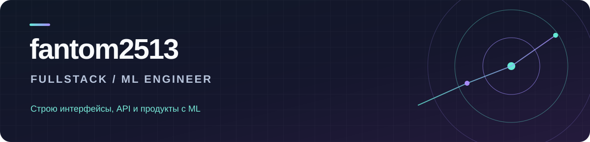

### Привет! Я `fantom2513` 👋

Разрабатываю веб-приложения и сервисы на стыке **fullstack-разработки и ML**: от интерфейса и API до интеграции моделей в рабочий продукт. Мне интересны инструменты, которые превращают сложные данные и процессы в понятный пользовательский опыт.

### Чем занимаюсь

- **Fullstack:** интерфейсы на React и TypeScript, серверная логика на Python и FastAPI, работа с PostgreSQL.
- **ML и LLM:** RAG-пайплайны, агентные сценарии, интеграция языковых моделей и LoRA-дообучение моделей порядка 20 млрд параметров.
- **Инженерия:** Docker, тестирование, CI/CD и развёртывание сервисов.

### Публичный проект

**[Mermaid Copilot](https://github.com/fantom2513/ujm-service)** — веб-приложение для генерации и редактирования UX-схем с помощью LLM. TypeScript, API, обработка документов и экспорт схем.

### Коммерческий опыт

Работал над закрытой платформой CX-аналитики: fullstack-сервисы, ML-функции и интеграция LLM. Использовал React, TypeScript, Python, FastAPI, PostgreSQL и Docker; для ML/LLM-задач — PyTorch, LangGraph, vLLM, RAG и pgvector. Также занимался LoRA-дообучением моделей порядка 20 млрд параметров.

### Технологии

`Python` · `FastAPI` · `TypeScript` · `React` · `PostgreSQL` · `PyTorch` · `RAG` · `pgvector` · `LangGraph` · `vLLM` · `LoRA` · `Docker` · `GitHub Actions`

Корпоративный код остаётся закрытым; здесь описаны только направления работы и технологии.
